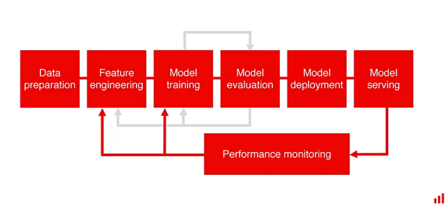
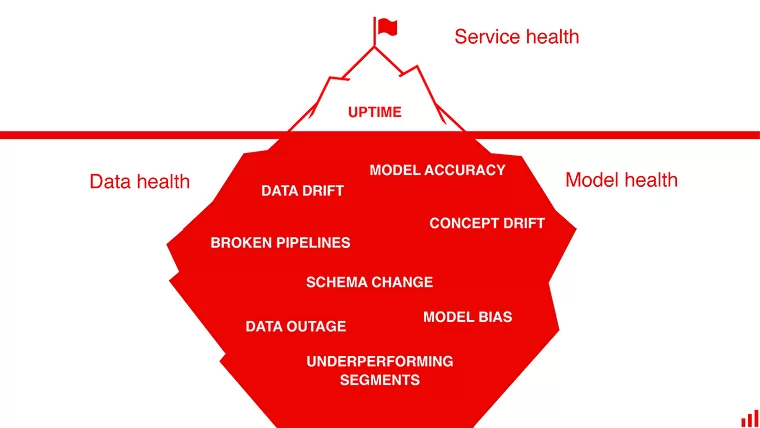

# Evidently AI blog: Machine learning monitoring

## Why

[Evidently AI blog]: https://evidentlyai.com/blog	"Machine learning monitoring"

Neglecting life after deployment of models is a result of a lack of maturity in companies AI usage.

A model is never final and without performance monitoring, one can't know if the model is performant in production and when its performance starts decaying.

Monitoring models shouldn't boil down to software engineering metrics (the health of a service from a software engineering perspective). It should include software engineering metrics, input and output data metrics, comparison to ground truth and business KPI.

If one waits for business KPI to show the failure, this is already way too late as it the failure has already impacted the company bottom line.

When the model starts failing whether in general or on a specific category, this should be detected quickly. Aggregate metrics can hide model failure on a specific subset of data.

