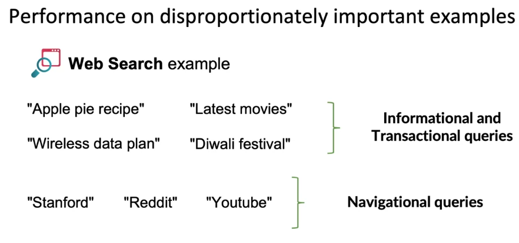
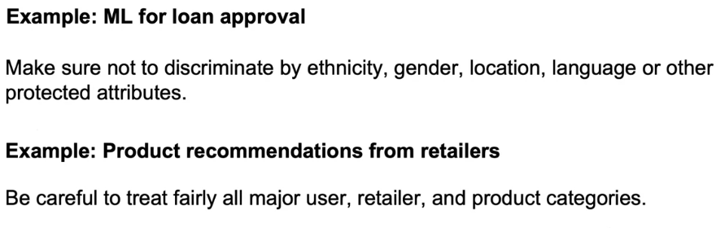
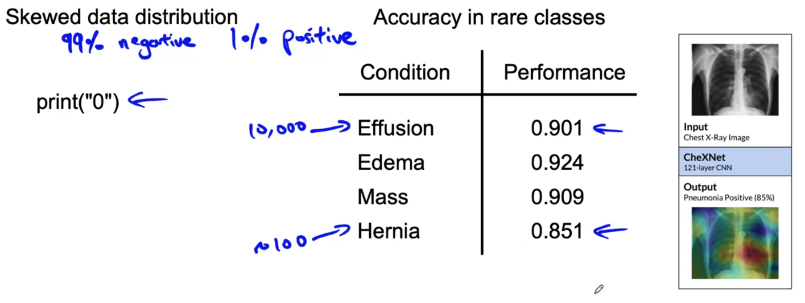
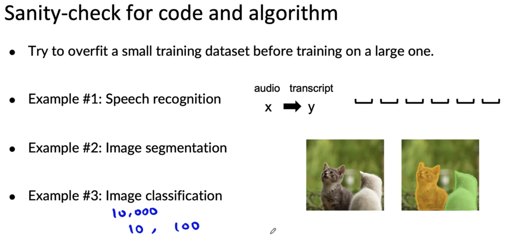

# Selecting and Training a Model

## Lecture 1: Modeling overview

## Lecture 2: Key challenges

AI system = Code (model/algorithm) + Data

**Challenges** in model development:

1. Doing well on training set
2. Doing well on dev/test sets
3. Doing well on business metrics/project goals: Doing well on dev/test sets doesn't mean doing well on business metrics

## Lecture 3: Why low average error isn't good enough

**Case 1: Performance on disproportionately important examples**

In the case of web search algorithm, the user wouldn't tolerate not getting the result she/he wants in case of navigational queries. The search engine will quickly lose the trust of its users in this case

**Case 2: Performance on key slices of the dataset**

Even if the ML model has high average testing accuracy, if it gives irrelevant predictions for some group then this might be unacceptable.

**Case 3: Rare classes**

Specifically in the case of **skewed data distribution** (imbalanced classes)

A related problem to this one is **accuracy in rare classes**. If someone has a rare medical condition, the model might do badly on it because it is not the present in the training dataset but from a medical standpoint, it might be unacceptable not to be detected. => *I think this one is the same as case 2.*

## Lecture 4: Establish a baseline

Establishing a baseline level of performance gives a point of comparison which helps decide where to focus one's efforts.

### Ways to establish a baseline

- Human level performance (HLP) => specially for unstructured data
- Literature for state-of-the-art/open source
- Quick-and-dirty implementation
- Performance of older system

In some case, baseline (e.g: HLP) also gives a sense of what is irreducible error/Bayes error.

## Lecture 5: Tips for getting started

- Literature search to see what's possible

- Find open-source implementations if available

- A reasonable algorithm with **good data** will often outperform a great algorithm with no so goo data

- Should deployment constraints should be taken into account? 

  - **Yes**, if baseline is already established and the goal is to build and deploy
  - **No (or not necessarily)**, if purpose is to establish a baseline and determine what is possible

- Sanity-check for code and algorithm

  

