# Learning objectives

- Identify the key challenges in model development.
- Describe how performance on a small set of disproportionately important examples may be more crucial than performance on the majority of examples.
- Explain how rare classes in your training data can affect performance.
- Define three ways of establishing a baseline for your performance.
- Define structured vs. unstructured data.
- Identify when to consider deployment constraints when choosing a model.
- List the steps involved in getting started with ML modeling.
- Describe the iterative process for error analysis.
- Identify the key factors in deciding what to prioritize when working to improve model accuracy.
- Describe methods you might use for data augmentation given audio data vs. image data.
- Explain the problems you can have training on a highly skewed dataset.
- Identify a use case in which adding more data to your training dataset could actually hurt performance.
- Describe the key components of experiment tracking.

# Table of content

- [Selecting and Training a Model](#selecting-and-training-a-model)
  
  * [Lecture 1: Modeling overview](#lecture-1-modeling-overview)
  * [Lecture 2: Key challenges](#lecture-2-key-challenges)
  * [Lecture 3: Why low average error isn't good enough](#lecture-3-why-low-average-error-isn-t-good-enough)
  * [Lecture 4: Establish a baseline](#lecture-4-establish-a-baseline)
    + [Ways to establish a baseline](#ways-to-establish-a-baseline)
  * [Lecture 5: Tips for getting started](#lecture-5-tips-for-getting-started)
  
- [Error analysis and performance auditing](#error-analysis-and-performance-auditing)
  
  * [Lecture 1: Error analysis example](#lecture-1-error-analysis-example)
  * [Lecture 2: Prioritizing what to work on](#lecture-2-prioritizing-what-to-work-on)
    + [Room for improvement](#room-for-improvement)
    + [Decide what category(ies) to improve](#decide-what-category-ies--to-improve)
    + [How to improve specific categories](#how-to-improve-specific-categories)
  * [Lecture 3: Skewed datasets](#lecture-3-skewed-datasets)
  * [Lecture 4: Performance auditing](#lecture-4-performance-auditing)
    + [Auditing framework](#auditing-framework)
    + [Speech recognition example](#speech-recognition-example)
  
- [Data iteration](#data-iteration)
  * [Lecture 1: Data-centric AI development](#lecture-1-data-centric-ai-development)
  
  * [Lecture 2: A useful picture of data augmentation](#lecture-2-a-useful-picture-of-data-augmentation)
  
  * [Lecture 3: Data augmentation](#lecture-3-data-augmentation)
    
    + [Good augmented data](#good-augmented-data)
    + [Data iteration loop](#data-iteration-loop)
    
  * [Lecture 4: Can adding data hurt?](#lecture-4-can-adding-data-hurt-)
  
  * [Lecture 5: Adding features](#lecture-5-adding-features)
  
  * [Lecture 6: Experiment tracking](#lecture-6-experiment-tracking)
  
  * [Lecture 7: From big data to good data](#lecture-7-from-big-data-to-good-data)
  
    

# Selecting and Training a Model

## Lecture 1: Modeling overview

## Lecture 2: Key challenges

AI system = Code (model/algorithm) + Data

**Challenges** in model development:

1. Doing well on training set
2. Doing well on dev/test sets
3. Doing well on business metrics/project goals: Doing well on dev/test sets doesn't mean doing well on business metrics

## Lecture 3: Why low average error isn't good enough

**Case 1: Performance on disproportionately important examples**

In the case of web search algorithm, the user wouldn't tolerate not getting the result she/he wants in case of navigational queries. The search engine will quickly lose the trust of its users in this case

**Case 2: Performance on key slices of the dataset**

Even if the ML model has high average testing accuracy, if it gives irrelevant predictions for some group then this might be unacceptable.

**Case 3: Rare classes**

Specifically in the case of **skewed data distribution** (imbalanced classes)

A related problem to this one is **accuracy in rare classes**. If someone has a rare medical condition, the model might do badly on it because it is not the present in the training dataset but from a medical standpoint, it might be unacceptable not to be detected. => *I think this one is the same as case 2.*

## Lecture 4: Establish a baseline

Establishing a baseline level of performance gives a point of comparison which helps decide where to focus one's efforts.

### Ways to establish a baseline

- Human level performance (HLP) => specially for unstructured data
- Literature for state-of-the-art/open source
- Quick-and-dirty implementation
- Performance of older system

In some cases, baseline (e.g: HLP) also gives a sense of what is irreducible error/Bayes error.

## Lecture 5: Tips for getting started

- Literature search to see what's possible

- Find open-source implementations if available

- A reasonable algorithm with **good data** will often outperform a great algorithm with no so goo data

- Should deployment constraints should be taken into account? 

  - **Yes**, if baseline is already established and the goal is to build and deploy
  - **No (or not necessarily)**, if purpose is to establish a baseline and determine what is possible

- Sanity-check for code and algorithm

  

  

# Error analysis and performance auditing

## Lecture 1: Error analysis example

The process of error analysis is **iterative**. The error analysis is done on the **dev test**.

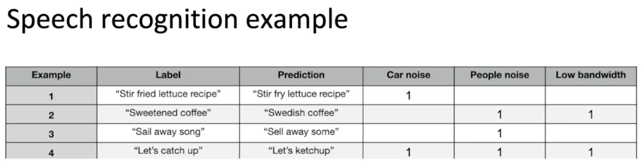

One may add tags and come up with new tags when doing error analysis. These tags are the categories that the model doesn't perform that good on and that we should improve the quality of the model on.

## Lecture 2: Prioritizing what to work on

### Room for improvement

In the table below, we consider the "Gap to HLP" as the **room for improvement** of our model as it represents the baseline in this example.

### Decide what category(ies) to improve

To prioritize what to work on, one has to decide which categories are most important to work on. The following are some criteria to take that decision

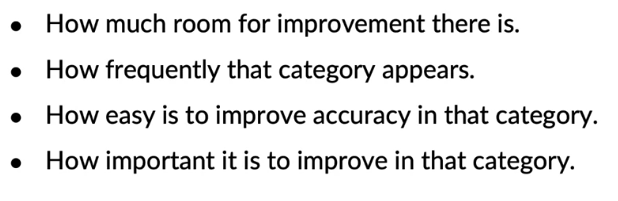

### How to improve specific categories

- Collect more data
- Use data augmentation to get more data
- Improve label accuracy/data quality

## Lecture 3: Skewed datasets

Use the confusion matrix, precision + recall and **F1-score** as well

If it's a multi-class problem, one can calculate these same metrics for all classes

Use the F1-score to prioritize which class to work on

## Lecture 4: Performance auditing

### Auditing framework

Brainstorm the ways the **system might go wrong** and establish **metrics** to assess performance against these issues on appropriate slices of data.

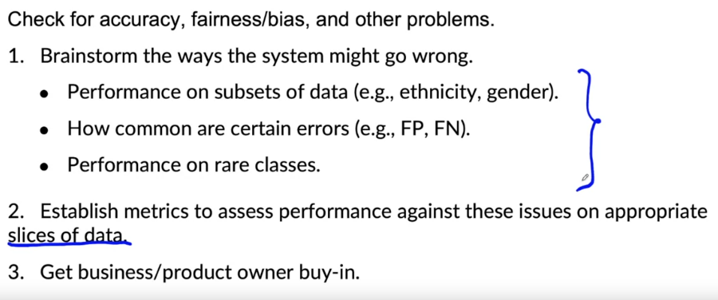

### Speech recognition example

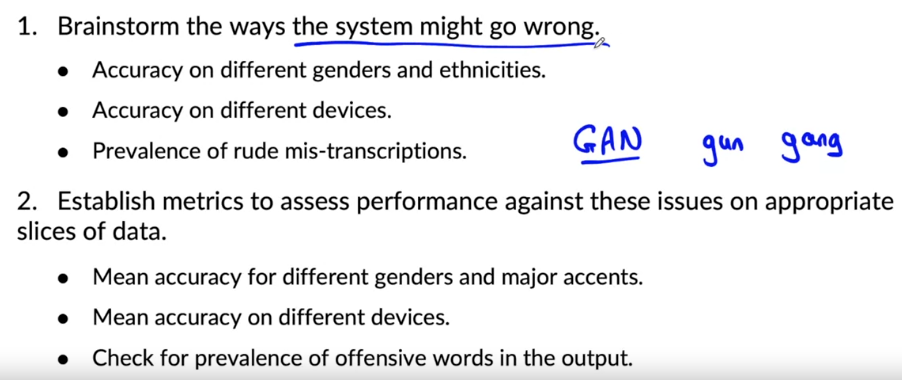

# Data iteration

## Lecture 1: Data-centric AI development

In a model-centric view: Hold the data fixed and iteratively improve the code/model.

In a data-centric view: Hold the code fixed and iteratively improve the data

There is a **role for both views**.

## Lecture 2: A useful picture of data augmentation

When having more data, you pull up the specific point in the blue curve as well as nearby points to HLP curve. This gives an idea about which categories

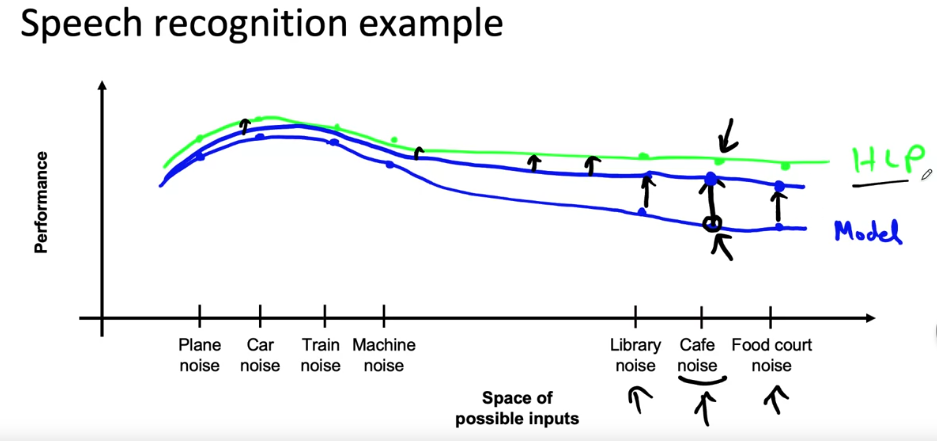

## Lecture 3: Data augmentation

### Good augmented data

Create realistic examples that

- the algorithm does poorly on

- but humans (or other baseline) do well on

Some people fiddle with the parameters of data augmentation, train the model, assess the results and reiterate by modifying the parameters of data augmentation. This is quite inefficient as every time data augmentation parameters are modified, the model needs to be retrained. Using the baseline method is a good method to sanity-check that the generated augmented data is useful.

In the case of speech recognition example:

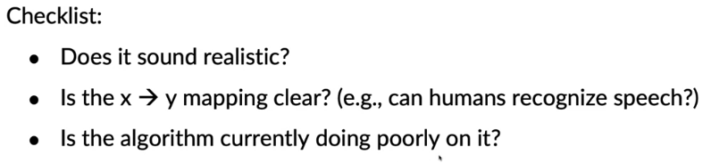

### Data iteration loop

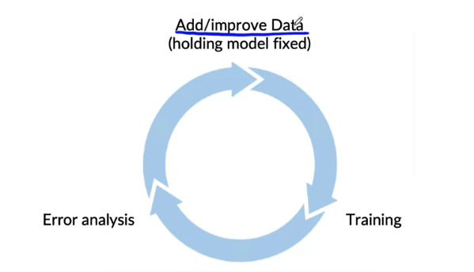

## Lecture 4: Can adding data hurt?

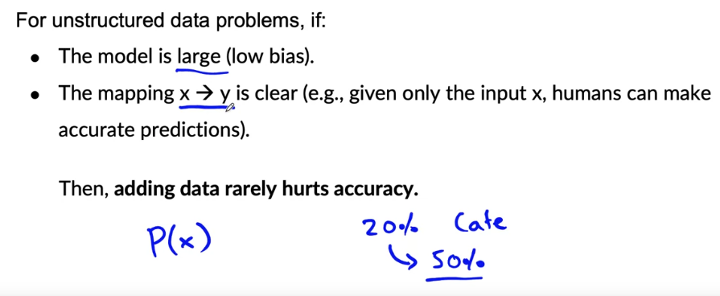

In computer vision problems, the mapping x->y might not be always that clear. The alphabet capital "I" might be mistaken for 1.

You might augment data to have more capital letter "I" but this will skew the dataset as in reality, this often represent 1 in addresses and consequently will push the algorithm to make poor predictions.

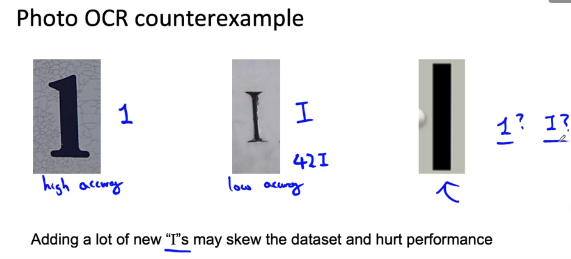

## Lecture 5: Adding features

This is useful for **structured data**

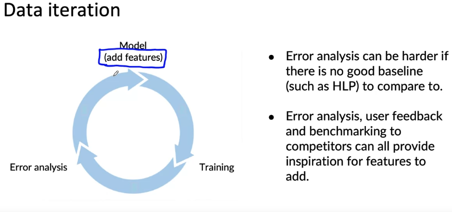

## Lecture 6: Experiment tracking

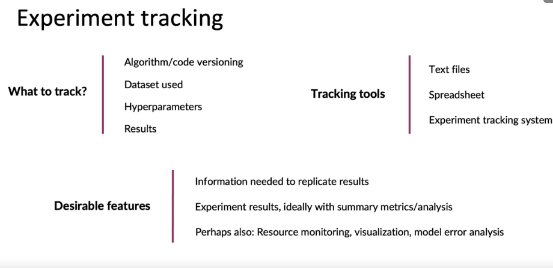

## Lecture 7: From big data to good data

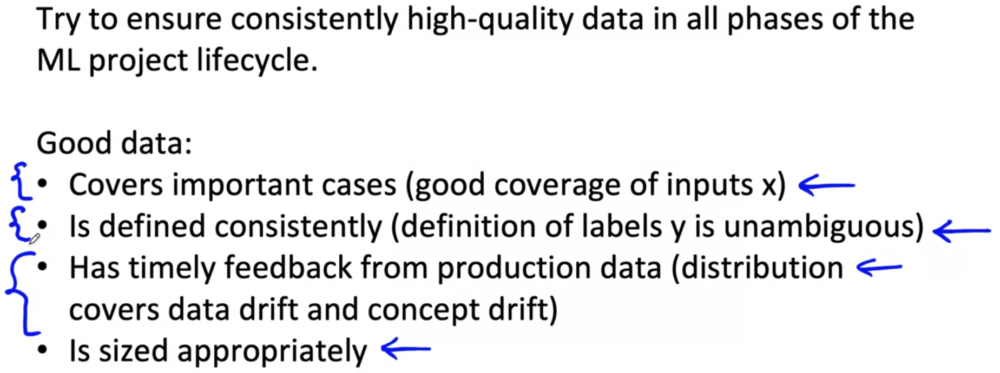

