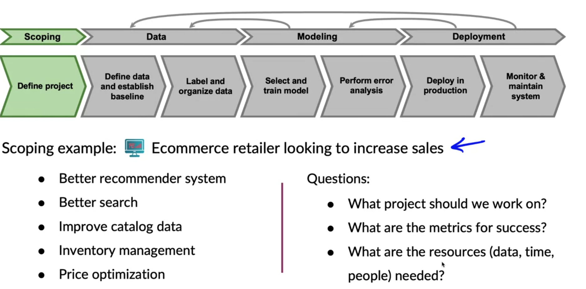

# Learning Objectives

- List the questions you need to answer in the process of data definition.
- Compare and contrast the types of data problems you need to solve for structured vs. unstructured and big vs. small data.
- Explain why label consistency is important and how you can improve it
- Explain why beating human level performance is not always indicative of success of an ML model.
- Make a case for improving human level performance rather than beating it.
- Identify how much training data you should gather given time and resource constraints.
- Describe the key steps in a data pipeline.
- Compare and contrast the proof of concept vs. production phases on an ML project.
- Explain the importance of keeping track of data provenance and lineage.

# Table of content

- [Define Data and Establish Baseline](#define-data-and-establish-baseline)
  * [Lecture 1: Why is data definition hard?](#lecture-1-why-is-data-definition-hard-)
  * [Lecture 2: More label ambiguity examples](#lecture-2-more-label-ambiguity-examples)
  * [Lecture 3: Major types of data problems](#lecture-3-major-types-of-data-problems)
    + [Types of problems](#types-of-problems)
    + [Unstructured vs. Structured data](#unstructured-vs-structured-data)
    + [Small data vs. Big data](#small-data-vs-big-data)
  * [Lecture 4: Small data and label consistency](#lecture-4-small-data-and-label-consistency)
    + [Label consistency](#label-consistency)
    + [The small within the big (Long tail problems)](#the-small-within-the-big--long-tail-problems-)
  * [Lecture 5: Improving label consistency](#lecture-5-improving-label-consistency)
    + [Improving label consistency](#improving-label-consistency)
    + [Small data vs. big data (unstructured data)](#small-data-vs-big-data--unstructured-data-)
  * [Lecture 6: Human level performance (HLP)](#lecture-6-human-level-performance--hlp-)
    + [Uses of HLP](#uses-of-hlp)
  * [Lecture 7: Raising HLP](#lecture-7-raising-hlp)
    + [Unstructured data](#unstructured-data)
    + [Structured data](#structured-data)
- [Label and Organize Data](#label-and-organize-data)
  * [Lecture 1: Obtaining data](#lecture-1-obtaining-data)
    + [How long should you spend obtaining data?](#how-long-should-you-spend-obtaining-data-)
    + [Data inventory](#data-inventory)
    + [Labeling data](#labeling-data)
  * [Lecture 2: Data pipeline](#lecture-2-data-pipeline)
    + [POC and Production phases](#poc-and-production-phases)
  * [Lecture 3: Meta-data, data provenance and lineage](#lecture-3-meta-data--data-provenance-and-lineage)
  * [Lecture 4: Balanced train/dev/test splits](#lecture-4-balanced-train-dev-test-splits)
- [Scoping](#scoping)
  * [Lecture1: What is scoping?](#lecture1-what-is-scoping-)
  * [Lecture 2: Scoping process](#lecture-2-scoping-process)
    + [Separate problem identification from solution](#separate-problem-identification-from-solution)
  * [Lecture 3: Diligence on feasibility and value](#lecture-3-diligence-on-feasibility-and-value)
  * [Lecture 4: Diligence on value](#lecture-4-diligence-on-value)
    + [How do you estimate the value of an ML project?](#how-do-you-estimate-the-value-of-an-ml-project-)
    + [Ethical considerations](#ethical-considerations)
  * [Lecture 5: Milestones and resources](#lecture-5-milestones-and-resources)

# Define Data and Establish Baseline

## Lecture 1: Why is data definition hard?

## Lecture 2: More label ambiguity examples

## Lecture 3: Major types of data problems

### Types of problems

The types of data problems are not the same when talking about structured and unstructured data + small and big data.

### Unstructured vs. Structured data

### Small data vs. Big data

In he big data case, establish a process with a small team of labelers and once the process is consistent, well defined and well established, share it with the whole pool of labelers. 

## Lecture 4: Small data and label consistency

### Label consistency

In point of transitions (the one in the middle), either collect more data but this option is expensive or **make some labelers sit with each other and decide what label to give**. This will cause your inputs to be labelled **consistently**.

### The small within the big (Long tail problems)

## Lecture 5: Improving label consistency

### Improving label consistency

- Have **multiple labelers** label same example, or even ask the same labeler to take a pause and **relabel after the pause**

- When there is a disagreement, have MLE, subject mater expert (SME) and/or labelers discuss definition of y to reach agreement. Make the **definition clear and consistent**

- If labelers believe that x doesn't contain enough information, **consider changing x**

- **Iterate** until it is hard to significantly increase agreement

- In case it's possible, **merge ambiguous classes** (e.g: shallow and deep scratch)

  

  

- Create a new borderline class that contains ambiguous examples (e.g: Instead of defect or not, use defect, borderline, 1)

### Small data vs. big data (unstructured data)

## Lecture 6: Human level performance (HLP)

Measuring HLP  helps estimating Bayes error/irreducible error and this helps with error analysis and prioritization

### Uses of HLP

- In academia, establish and beat a respectable benchmark to support publication

- Business or product owner asks for 99% accuracy. HLP helps establish a more reasonable target.

- "Prove" the ML system is superior to humans doing the job and thus the business or product owner should adopt it. **This argument should preferably not be used or should be used with caution**. Depending on the way of measuring HLP, the learning algorithm might have an unfair advantage.

  

## Lecture 7: Raising HLP

### Unstructured data

### Structured data

# Label and Organize Data

## Lecture 1: Obtaining data

### How long should you spend obtaining data?

Get into the loop quickly and reiterate. An exception would be having a previous experience with the problem and you know how many examples you need.

### Data inventory

Inventory the data sources (Don't forget the time cost), and then decide which data source(s) to use

### Labeling data

But if you have some examples, by how much you have to increase your data? Don't increase data by more than 10x at a time. Iterate once you do this=> error analysis. If you increase by more than 10x, It will more likely become difficult to predict what's going to happen as the dataset changes completly.

You can also increase it by 10% or 15%. 10x is an upper-bound.

## Lecture 2: Data pipeline

How to **replicate** the pre-processing scripts between the dev phase and the production phase?

### POC and Production phases

## Lecture 3: Meta-data, data provenance and lineage

**Data provenance** refers to where the data comes from.

**Data lineage** is the sequence of processing steps applied to it

**Metadata** is useful for:

- Error analysis. Spotting unexpected effects
- Keeping track of data provenance

## Lecture 4: Balanced train/dev/test splits

Pay attention when working with a small dataset, make sure you use a balanced dataset

# Scoping

## Lecture1: What is scoping?

There are many ways to achieve some objective. To be able to well scope it ad choose the right project will significantly increase the impact of your work.

## Lecture 2: Scoping process

1. Brainstorm business problems (not AI projects) -> Identify the problem
2. Brainstorm AI solutions -> Identify the possible solutions
3. Assess the feasibility of potential solutions
4. Determine milestones
5. Budget for resources

### Separate problem identification from solution

## Lecture 3: Diligence on feasibility and value

Is this **project technically feasible**?

- Why use **HLP to benchmark**? People are very good on unstructured data tasks => **Criteria**: Can a human, ***given the same data***, perform the task?

- Do we have **features** that are **predictive**? Examples:

  

- **History of project** => gives a sense of what's feasible in the future for an existing project 

  

## Lecture 4: Diligence on value

### How do you estimate the value of an ML project? 

Example:

### Ethical considerations

Debate and discuss openly the ethical considerations of the project

## Lecture 5: Milestones and resources

Now that you have a problem as well as potential solutions, finished diligence for technical feasibility and value and you think the project is worth doing, there comes the last step, determining milestones and resources. This involves **writing out the key specifications for the project**.

