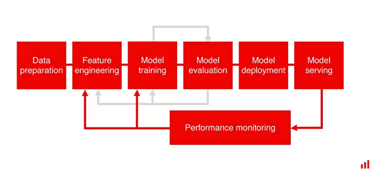
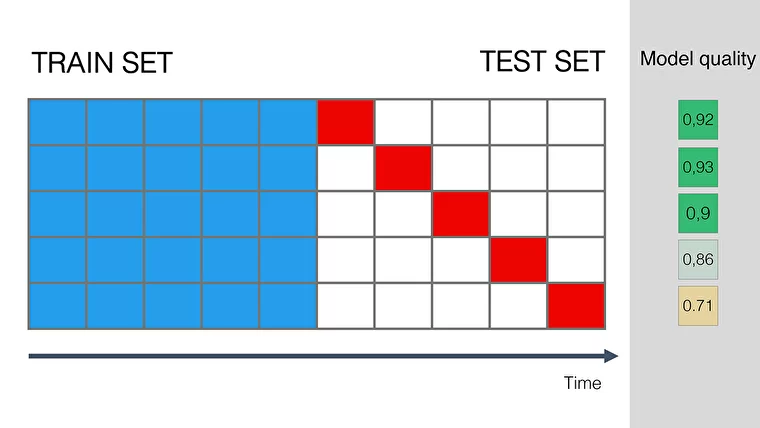
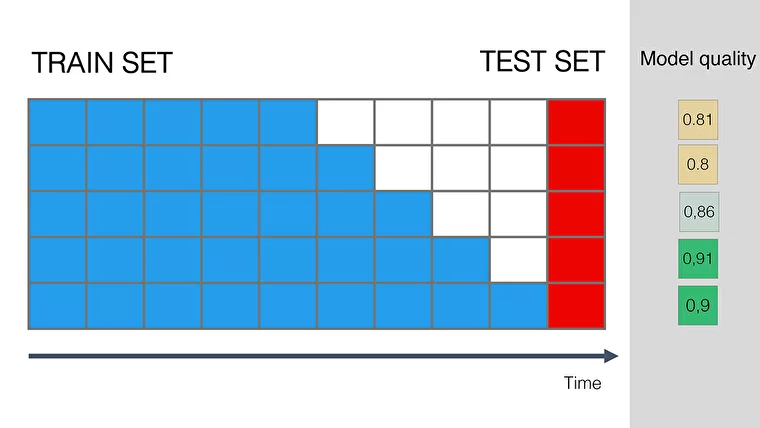
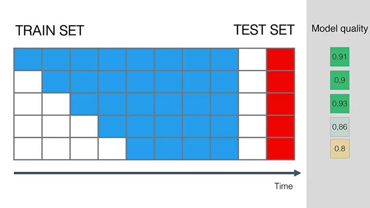

# Evidently AI blog: Machine learning monitoring

These are my own notes that I took when reading the  [Evidently AI Blog](https://evidentlyai.com/blog)

## Table of content

* [Why?](#why)
* [Who should care?](#who-should-care)
* [What are we missing?](#what-are-we-missing)
* [What can go wrong with data?](#what-can-go-wrong-with-data)
* [What else can go wrong?](#what-else-can-go-wrong)
  + [Drift definition](#drift-definition)
  + [Dealing with drift](#dealing-with-drift)

- [To retrain or not to retrain?](#to-retrain-or-not-to-retrain)

  

## Why?

Neglecting life after deployment of models is a result of a lack of maturity in companies AI usage.

A model is never final and without performance monitoring, one can't know if the model is performant in production and when its performance starts decaying.

Monitoring models shouldn't boil down to software engineering metrics (the health of a service from a software engineering perspective). It should include software engineering metrics, input and output data metrics, comparison to ground truth and business KPI.

If one waits for business KPI to show the failure, this is already way too late as it the failure has already impacted the company bottom line.

When the model starts failing whether in general or on a specific category, this should be detected quickly. Aggregate metrics can hide model failure on a specific subset of data.

## Who should care?

The **data team** should care as it wants the model to make the right call + problem detection as early as possible. **Business and domain experts** acts on model predictions and wants to know the model weak spots if any show up in production.

**Different metrics** should be monitored, data scientist don't use the same metrics as domain experts + failure detection might be, depending on the problem, easier from a specific perspective => Both business experts and the data team should have access to monitoring tools.

## What are we missing?

Most data science teams monitor models only in the first months and as new project come up, they often let go this task.

The problem in machine learning is that deploying a model often includes different teams: data engineering, data scientist/ML engineers, DevOps as well as an IT team that might be watching over service health. When a model fails, there is no clear separation between territories and this makes it a **grey zone**.

## What can go wrong with data?

- Data can be lost at source: Users actions on a mobile app not logged
- Data processing issues because of lost access, infra update, broken feature code, etc
- Data schema change
- Broken upstream models: a model's input is some model's output. If something's wrong with the 1st, garbage in when it comes to the 2nd.

Monitoring data quality at every step of the pipeline is a basic health check.

## What else can go wrong?

### Drift definition

(In this paragraph, we suppose that data quality is fine)

Models get worse over time with a different speed. This happens for a couple of reasons:

- **Data drift**: the inputs X has changed. This is also called feature drift, population or covariate shift. The model is fine and it does well on data similar to old data, but as new data has changed with regards to the old one, the model does badly now.

  To address data drift, one needs to train the model on the new data or rebuild it for the new segment.

- **Training-serving skew**: It is a mismatch between the training data and the real data. It usually shows up at the first attempt of applying the model to real data. This usually happens when training data is an artificial one.

  When this happens, either collect data or profit from real data coming in while the model in production and use it to retrain the model.

- **Concept drift**: happens when the very meaning of what we are trying to predict evolves, the mapping X->y changes. Sometimes concept drift impact only the relation of one feature Xi to y and not all other features.

  Concept drift ***usually happens gradually*** because the world evolves in a gradual way but this depends on the fields and on events happening in the world.  It is **possible to get an estimate of time needed for a model to age** by imitating the phenomena on old data to which we have ground truth.

  ***Sudden concept drift*** also happen. Mobility models or online purchases models failed because of covid. When a production line is revamped or machines changed, fault prediction models might fail.

### Dealing with drift

- Retrain a new model with more weights on recent data or drop past data if enough is collected.
- Naïve retraining is not always the solution. Sometimes redefining the model scope (e.g. predictions horizon) or the business process is necessary.

## To retrain or not to retrain?

To decide whether to retrain the model, several checks need to be made. But the general **idea is simple**, **simulate the effects** that might take place while training the model. But keep in mind, simulations are as good as the resemblance between real life conditions and simulation conditions + they only give estimates. **Monitoring** is what gives a crystal clear idea.

- **Check 1: How much data does the model need?** If the model hadn't reached a plateau in the previous training, add the recent data (collected while the model is deployed) to training. If it had reached a plateau in the previous training, it's time to retrain.

- **Check 2: How quickly will the quality go down in production?** Simulate the process of deploying a model while training. Fix the training set and test on a test that is further in time - e.g: test on next month from the training, the month after that, etc till its performance starts decaying. That should give you a rough estimate for how much time it will take for its performance to start decaying.

  

  

  Sometimes, there is no need to retrain. The model may just need active learning or maybe it just underperforms on a specific segment of data. A fallback should be created for that particular segment.

- **Check 3: How often is new data received?** If a model starts decaying after a week and new data is collected on monthly-basis, you have multiple solutions.

  - Build several models, some data might be received on daily basis and some of it on monthly basis
  - Add a fallback rule for when the model starts decaying (specially for important segment)
  - Feature-engineer the features so that the model decays less rapidly

- **Check 4: If the data comes too often, how often should we retrain the model?** This time fix the test set far in time and add recent data to the training set in a bucketed way. If the model performance becomes much much better, then you'll profit from retraining the model often. This also gives an estimate of how often you should do it.

​	If there is no real performance gain, just don't do it: it's energy-consuming and an error-prone operation.

- **Check 5: Should you drop the old data?** This time, we have to simulate this by remove from past training data. 
  - if dropping the old data makes the **model worse**, don't drop it. 
  - If the **quality's not affected**, remove it (lightweight's better!).
  - If dropping data **improves the model performance**: old patterns not that important. Drop it or use weights but pay attention to categories that might not present in the new data sample that you've just got.

