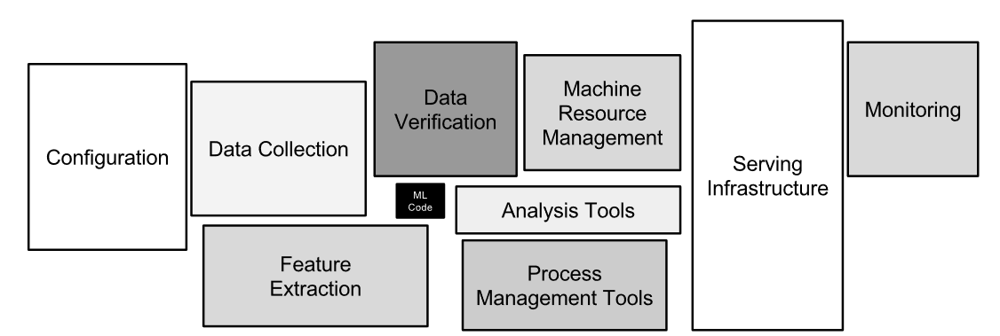

# Hidden Technical Debt in Machine Learning Systems

The article discusses technical debt linked to ML systems and proposes ways of mitigating some of the problems listed.

ML systems in this article are represented as follows:

## Complex models erode boundaries

Software engineering practices like abstraction and modular design that creates maintainable code (+ isolated changes) don't apply to ML systems.

**Entanglement:** Changing anything changes everything. The slightest change (adding a feature, removing one, change in hyperparameters) can't be isolated. Solution: Use ensembles if errors are uncorrelated with the existing model mA.

**Correction cascades:** Solving a problem *A'* by building a model *mA*' on top of a model *mA* that solves a similar problem *A*... This cascading of models creates an improvement deadlock, no model lower in the chain can be improved without system-level detriments. Solution: either augment mA to solve A' or build a separate model mA'.

**Undeclared consumers:** When dealing with pressing deadlines, people will use any usable signal at hand. Undeclared consumers create undeclared cascades + they can create hidden feedback loop. Solution: Guard against this behavior with (e.g) access restrictions.

## Data Dependencies Cost More than Code Dependencies

**Unstable data dependencies:** Improvements or ramifications to an input signal (or an unstable input signal over time) have arbitrary impact on the consuming ML system and are costly to diagnose and address. Solution: When diagnosing, a system of data versioning may help but this comes with some overhead of its own.

**Underutilized data dependencies**: These are input signals that provide little incremental modeling benefit. Solution: These can be detected via exhaustive leave-one-feature-out evaluations.

**Static analysis of data dependencies**: Tools for error checking, tracking down consumers and forcing migration and updates are not that common.

## Feedback loops

ML systems in some cases end up influencing their own behavior and this creates an analysis debt as it becomes difficult to predict the behavior of a certain model. This happens under tow main forms.

- **Direct feedback loops**: A model influences the selection of its own future training (when online training or retraining on live data). This happens for example when the model impacts the behavior of customer (e.g: recommendation systems). Solution: Using randomization or isolating parts of data from being influenced by a given model.
- **Hidden feedback loops**: Two systems impact each other, a change in one system leads to a change in a second one even if the two are somehow independent. Two stock market prediction models by two different companies, in case there is an improvement to one of them or a bug, it influences the bidding behavior of the other. 
