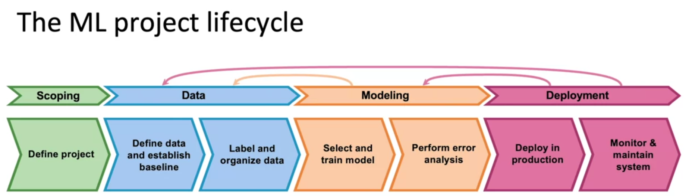
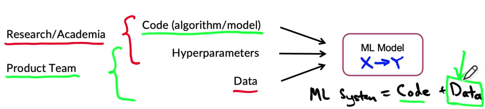
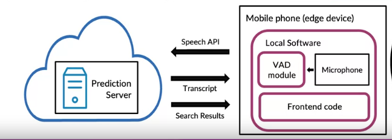
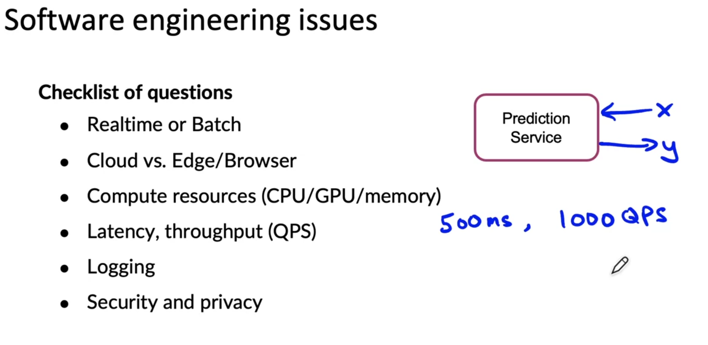
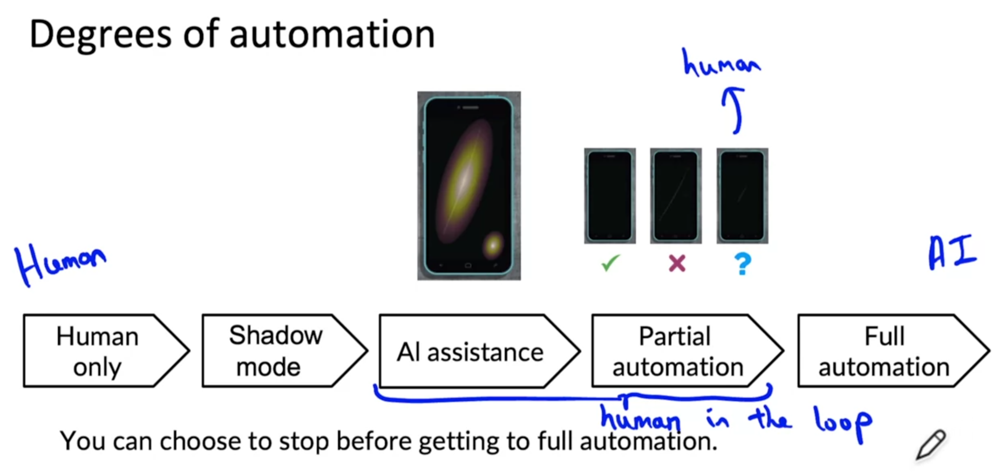
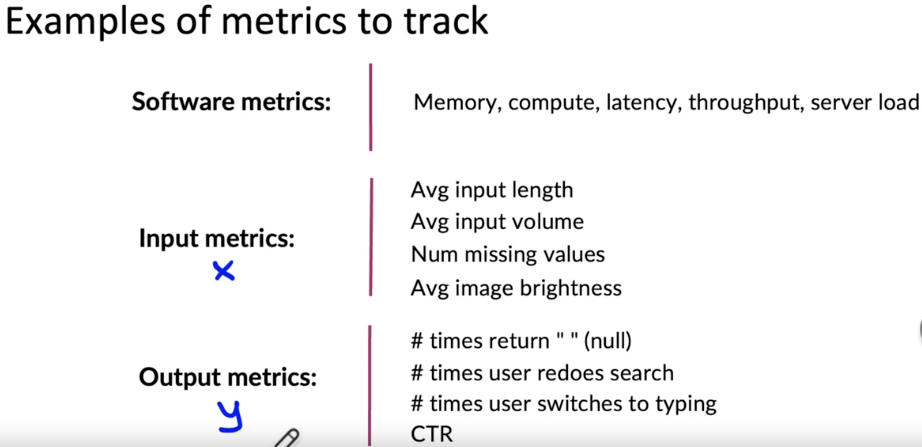
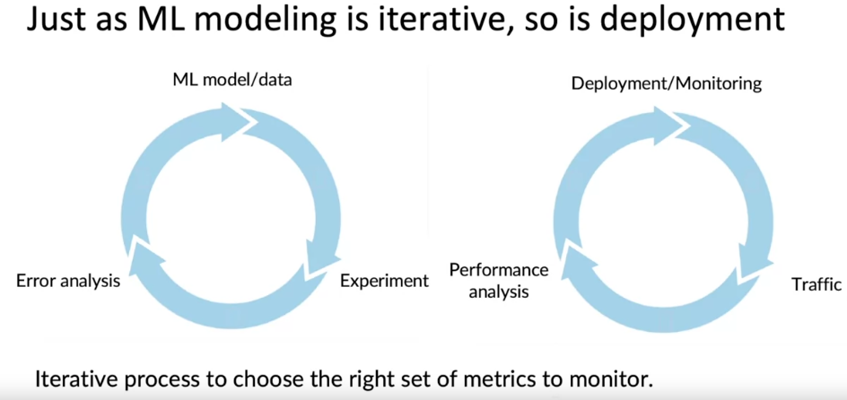

- [The Machine Learning Project Lifecycle](#the-machine-learning-project-lifecycle)
  
  * [Lecture 1: Welcome](#lecture-1-welcome)
  * [Lecture 2: Steps of an ML Project](#lecture-2-steps-of-an-ml-project)
  * [Lecture 3: Case study - speech recognition](#lecture-3-case-study---speech-recognition)
    + [In the scoping stage](#in-the-scoping-stage)
    + [In the Data stage](#in-the-data-stage)
    + [In the Modeling stage](#in-the-modeling-stage)
    + [In the Deployment stage](#in-the-deployment-stage)
- [Deployment](#deployment)
  
  * [Lecture 1: Key Challenges](#lecture-1-key-challenges)
    
    + [Data issues](#data-issues)
    + [Software engineering issues](#software-engineering-issues)
    
  * [Lecture 2: Deployment patterns](#lecture-2-deployment-patterns)
    
    + [Patterns of deployment](#patterns-of-deployment)
    + [Degrees of automation](#degrees-of-automation)
    
  * [Lecture 3: Monitoring](#lecture-3-monitoring)
  
    

# The Machine Learning Project Lifecycle

**MLOps** (Machine Learning Operations) is an emerging discipline, and comprises a **set of tools and principles** to support **progress through the ML project lifecycle**.

## Lecture 1: Welcome 

The requirements surrounding ML infrastructure

## Lecture 2: Steps of an ML Project

## Lecture 3: Case study - speech recognition

### In the scoping stage

- Decide to work on speech recognition for voice search
- Decide on key metrics
  - Accuracy, latency, throughput
- Estimate (guestimate) resources and timeline

### In the Data stage

- Is the data labeled consistently?
- How much silence before/after each clip?
- How to perform volume normalization?

### In the Modeling stage

As a starting point, use some open-source code from Github and try in on the data. Performing error analysis will help you target which kind of data to collect more of, how to adapt it to the task and also how to modify the code (model). But focus on the data!

When error-analysis suggests that your model is good enough, you can go to Deployment!

### In the Deployment stage

For this example, the deployment infrastructure looked like this

***Concept/Data drift*** example: System trained on adult voices, failed when dealing with teens voices. The data distribution changed between the training and the real world.

# Deployment

## Lecture 1: Key Challenges

A couple of major challenges:

- statistical issues
- software engineering issues

### Data issues

**Data drift:** is when the inputs X distribution changes, such as when someone becomes a star and is mentioned very often

**Concept drift:** When the mapping X->y changes. if someone were to make many purchases online before covid, this pattern may have been flagged but this has changed with covid and this behavior has become the norm.

Houses price prediction model example:

- If people starts building larger houses, this is a change in X
- If there is an inflation, then a house with the same properties (same X) sees its price go up (change in y)

When data changes, it's either a *gradual change* (like the introduction of new vocabulary in a language) or a *sudden change* (like the changes due to covid-19)

### Software engineering issues

There are also differences between first-time deployment and maintenance.

## Lecture 2: Deployment patterns

### Patterns of deployment

- **Shadow mode**: When you have people doing a task, you can start using shadow mode. It means that an ML system shadows the human and runs in parallel. During this phase, the ML system's output is not used for any decisions during this phase. This phase helps in deciding whether or not the model can make some real decisions in the future.
- **Canary deployment**: Roll out the algorithm to a small fraction (5%) of traffic initially, then monitor the system and ramp up traffic gradually.
- **Blue green deployment**: Spin up a new prediction server (the green version), have a router switch to the new version, and in case of a problem, the router can enable a rollback very quickly. The re is no need to make a 100% switch, a gradual switch can be used.

### Degrees of automation

AI assistance in which AI assists a human by showing her/him where to look but the human makes the decision.

Partial automation: Only cases where the algorithm is not sure are sent to a human and the human inputs can be used to further train the model.

## Lecture 3: Monitoring

Many people use a monitoring dashboard to monitor models. The **first steps** should be to:

- Brainstorm the things that could go wrong

- Brainstorm a few statistics/metrics that will detect the problem

- It's ok to use many metrics initially and gradually remove the ones that you find not useful

  

  

Deployment is an iterative process, and so is the choice of metrics to monitor

In the monitoring dashboard, set **threshold for alarms** and **adapt the metrics and thresholds** over time

When it comes to **maintaining a model**, one can choose manual retraining (very common) or automatic retraining (mainly used in consumer software internet). Sometimes it's necessary to go to the data step first rather than goin directly to the modeling step.

