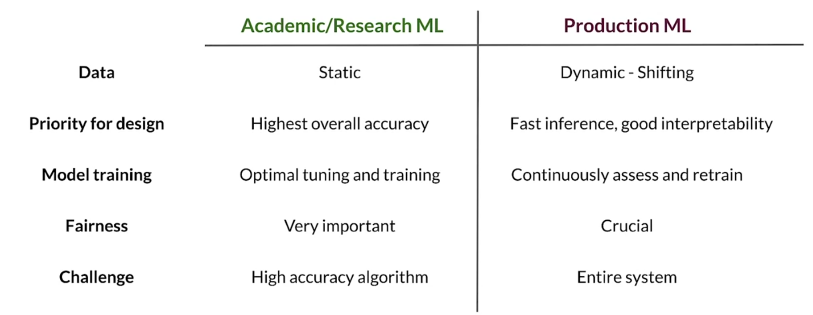
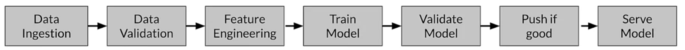
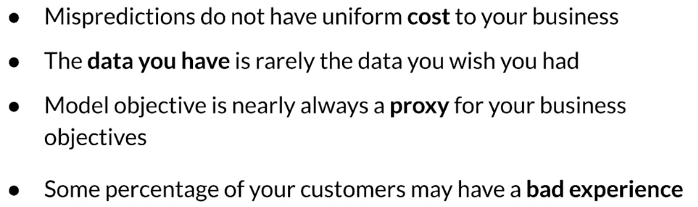
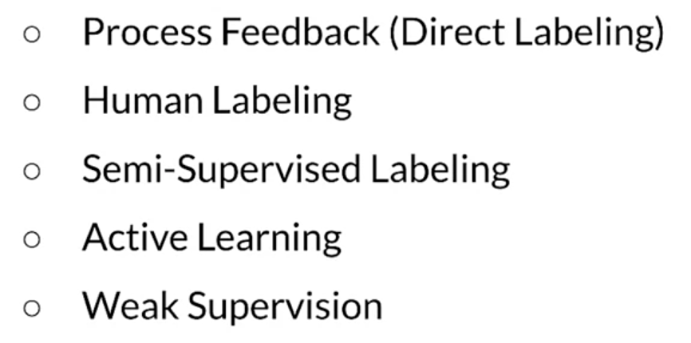
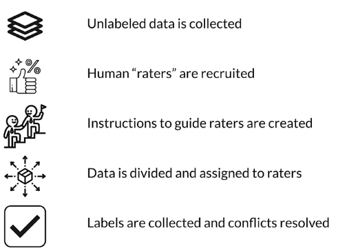
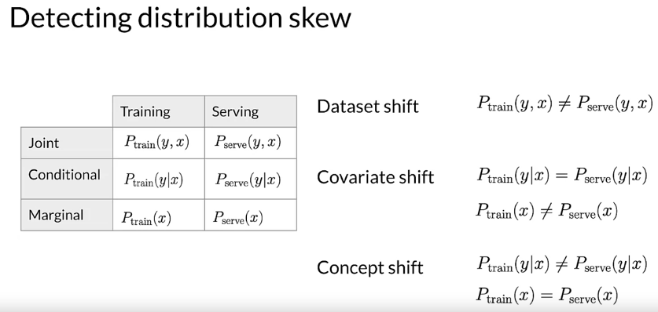

# Intro to ML Engineering in Production

## Lecture 1: Overview

Academic ML vs. Production ML

In production grade ML, there are several challenges:

- Build integrated ML systems
- Continuously operate it in production
- Handle continuously changing data
- Optimize compute resource costs

## Lecture 2: ML pipelines

An **ML pipeline** is  software architecture to implement the ML workflow. Its **goal** is to automate, monitor and maintain model training and deployment.

ML workflows are usually a **directed acyclic graph** (DAG). **Orchestrators** (e.g: Airflow, Kubeflow, Luigi) are responsible for scheduling various components of an ML pipeline based on dependencies defined by a DAG.

**Tensorflow Extended** (TFX) is an open-source end-to-end platform for deploying production ML pipelines. A TFX pipeline is a sequence of  scalable components that can handle large volumes of data.

# Collecting data

## Lecture 1: Importance of data

In an ML pipeline, Data is a first class citizen. Code in Software = Data in an ML application.

Meaningful data is data that has some predictive content to it. It should **maximize predictive content** (and remove non-informative data) and **should have a good feature space coverage**.

## Lecture 2: Example Application

## Lecture 3: Responsible Data: Security, Privacy & Fairness

ML systems can fail users in different ways:

- **Representational harm**: A system amplifies or reflects a negative stereotype about a particular group
- **Opportunity denial**: A system makes predictions that have real-life negative impacts (and sometimes may have lasting consequences)
- **Disproportionate product failure**: You get skewed outputs more frequently for a particular group of users
- **Harm by disadvantage**: when the system infers disadvantageous associations with particular demographics and the user behavior

# Labeling Data

## Lecture 1: Case study: Degraded model performance

### What causes models performance to degrade?

- **Slow/gradual problems**: drift
  - Data changes: Distribution of features changes - Relative importance of features changes
  - World changes: Styles change, Scope and processes change, Competitors change, Expansion to other geos
- **Fast/Sudden problems**: Bad sensor, software upgrade
  - Data collection problems: Bad sensor, bad log data
  - Systems problem: Bad software update, network connectivity, System down, Bad credentials

### Why understand the model?

## Lecture 2: Data and Concept change in production ML

- **Easy problems**: Ground truth changes slowly (months, years). In this case, model retraining is driven by model improvements, better data, changes in software or system, etc.
- **Harder problems**: Ground truth changes faster (weeks). In this case, model retraining is driven by declining model performance + the same reasons as easy problems
- **Really hard problems**: Ground truth changes very fast (days, hours, min) like in the stock market. Labeling is very challenging for new data and the model performance declines quickly.

## Lecture 3: Process feedback and human labeling

There are various methods for data labeling.

- **Process feedback**: actual vs. predicted => using the actual as new labels. This allows for training dataset continuous creation and it captures strong signals. This is not always possible, it depends on the inherent nature of the problem.

- **Human labeling**: People examine data and assign labels to it manually. Human labeling can be difficult for humans, slow and expensive. The methodology is as follows

  

# Validating Data

## Lecture 1: Validating data

### Definitions

**Drift**: Changes in data over time, such as data collected once a day

- Data drift: Changes in the statistical properties of the features
- Concept drift: Changes in the mapping between the features and the labels.

**Skew**: Difference between two static versions, or different sources, such as training and serving set.

- **Schema skew**: Training and serving data do not conform to the same schema
- **Distribution skew**: Dataset shift -> Covariate or concept shift
  - **Covariate shift** is when the distribution of the features is different between the training and serving
  - **Concept shift** is when the distribution of the features remains unchanged but the relationship (concept) between the labels and the features changes.

